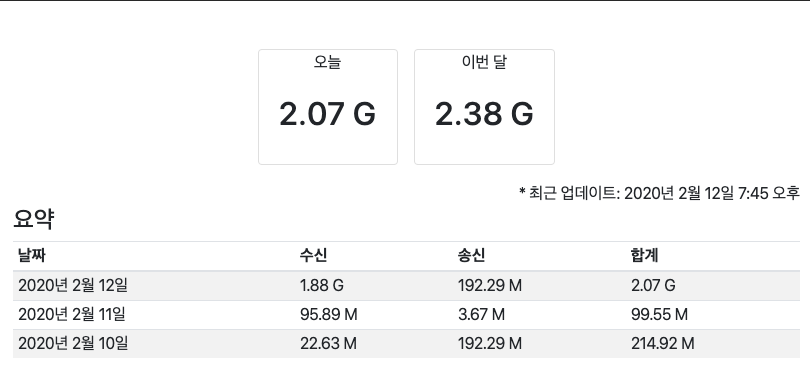
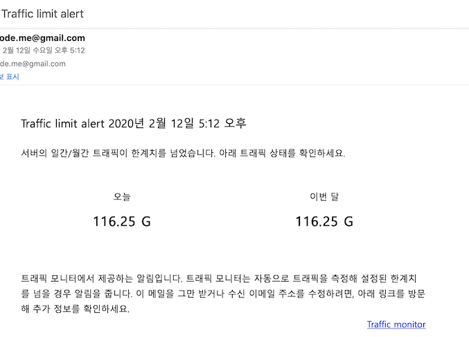

======================
django-traffic-monitor
======================

|PyPi|_ |Downloads|_ |LGTM|_

.. |PyPi| image:: https://img.shields.io/pypi/v/django-traffic-monitor.svg
.. _PyPi: https://pypi.org/project/django-traffic-monitor/

.. |Downloads| image:: https://pepy.tech/badge/django-traffic-monitor
.. _Downloads: https://pepy.tech/project/django-traffic-monitor

.. |LGTM| image:: https://img.shields.io/lgtm/grade/python/g/genonfire/django-traffic-monitor.svg?logo=lgtm&logoWidth=18
.. _LGTM: https://lgtm.com/projects/g/genonfire/django-traffic-monitor

django-traffic-monitor is a Django application that eases to monitor server traffic.

Quick start
-----------

1. install with pip::

    pip install django-traffic-monitor django-crontab

2. Add "traffic_monitor" and "django-crontab" to your INSTALLED_APPS setting like this::

    INSTALLED_APPS = [
        ...
        'django_crontab',
        'traffic_monitor',
    ]

3. Include the traffic_monitor URLconf in your project urls.py like this::

    urlpatterns += [
        path('traffic/', include('traffic_monitor.urls', namespace='traffic_monitor'))
    ]
    
3. If you are more of url person than path::

    urlpatterns += [
        url(r'^traffic/', include('traffic_monitor.urls'), namespace='traffic_monitor')),
    ]

4. Run migrate to create the traffic_monitor models.::

    python manage.py migrate

5. Find out your server's network interface names using Linux command like ifconfig then set the name or names you wish to monitor in your project setting such as settings.py.::

    TRAFFIC_MONITOR_INTERFACE_NAMES = 'docker0,p2p1,eth0'

6. Email setting required for Django. If sending email in your project is currently working, no need to change it or add it to your settings.::

    EMAIL_BACKEND = 'django.core.mail.backends.smtp.EmailBackend'
    EMAIL_HOST = 'smtp.gmail.com',
    EMAIL_PORT = 587
    EMAIL_USE_TLS = True
    EMAIL_HOST_USER = 'your_email_id@gmail.com',
    EMAIL_HOST_PASSWORD = 'your_password,
    DEFAULT_FROM_EMAIL = 'your_email_id@gmail.com'

7. (Optional) Set more configurations if you want to change from default.::

    # Permission to use: superuser, staff, member, all
    TRAFFIC_MONITOR_PERMISSION = 'staff'

    # Template for traffic monitoring page
    TRAFFIC_MONITOR_TEMPLATE = 'traffic_monitor/show_traffic.html'

    # Alarm will be sent if daily traffic exceeds
    TRAFFIC_MONITOR_DAILY_ALARM_BYTES = 100 * 1024 * 1024 * 1024

    # Alarm will be sent if monthly traffic exceeds
    TRAFFIC_MONITOR_MONTHLY_ALARM_BYTES = 800 * 1024 * 1024 * 1024

    # Alarm From Email
    TRAFFIC_MONITOR_EMAIL_FROM = DEFAULT_FROM_EMAIL

    # Alarm Email To (comma seperated list, can be more than one)
    TRAFFIC_MONITOR_EMAIL_TO = [DEFAULT_FROM_EMAIL]

    # Set False if you do not want to get email
    TRAFFIC_MONITOR_ALARM_SEND_EMAIL = True

    # Subject of email
    TRAFFIC_MONITOR_ALARM_EMAIL_SUBJECT = 'Traffic limit alert'

    # If traffic limit exceeds, the next alarm will be sent only if the traffic exceeds threshold from previous alarm
    TRAFFIC_MONITOR_ALARM_BYTES_THRESHOLD = 10 * 1024 * 1024 * 1024

8. Add cronjob in your settings.py to collect traffic automatically. (i.e. run every 5 minutes)::

    CRONJOBS = [
        ('*/5 * * * *', 'traffic_monitor.tools.read_bytes', '>> /var/log/cronjob.log'),
    ]

9. Run following command to add CRONJOBS to your system crontab::

    python manage.py crontab add

10. Connect <server address>/traffic/ to check current traffic.

11. If traffic limit exceeds, email will be sent.

12. If error especially UNKNOWN APP NAME happens while installing with pip, please upgrade your setuptools.::

    pip install setuptools --upgrade
